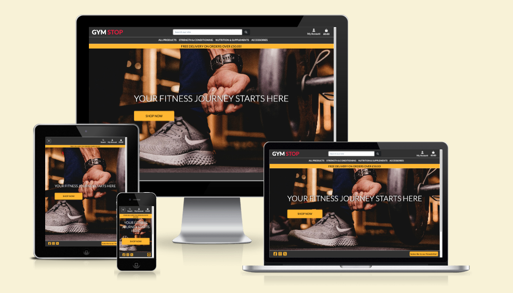
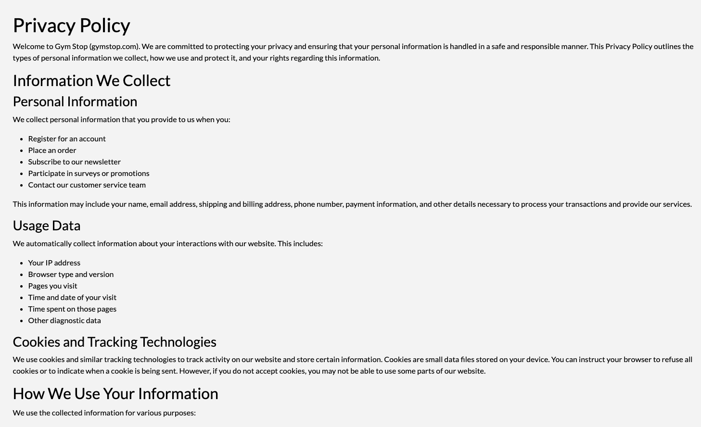
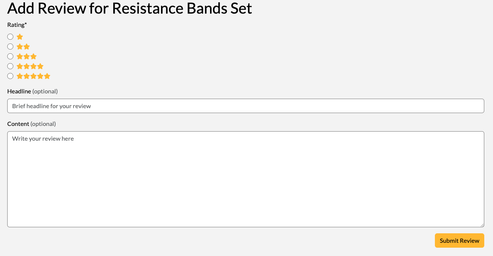

# Gym Stop



Gym Stop is an e-commerce website designed for users to search for and purchase a range products, leave reviews, create an account and subscribe to marketing emails.

The main goal for this application is to offer an easy-to-use and visually pleasing e-commerce website for the user.

Visit the deployed site [here](https://danh12-gym-stop-6494ee93884f.herokuapp.com/).

---

# User Experience (UX)

## Project Goals

- The application can be easily navigated and understood.
- Clearly explains the purpose of the application.
- Clearly explains how to use the application.
- Contains clear imagery and content.
- Provides interactivity in the form of clickable elements.
- Provides feedback when the user performs a specific function.
- Provides users with the ability to create their own profile.
- Provides users with the ability to view and search for a variety of products.
- Provides users with the ability to search all products depending on keyword.
- Provides users with the ability to purchase products.
- Provides users with the ability to subscribe/unsubscribe to marketing emails.
- Provides users with the ability to add/edit/delete a review of a product they have purchased.
- The application can be viewed on a variety of screen sizes.

## User Stories

### Viewing and Navigation

- **As a** user, **I want** to be able to navigate the application easily, **so that** I can start using the application as soon as possible.
- **As a** Shopper, **I want** to view a list of products **so that** I can select some to purchase.
- **As a** Shopper, **I want** to view individual product details **so that** I can identify the price, description, product rating, product image, and available sizes.
- **As a** Shopper, **I want** to easily view the total of my purchases at any time **so that** I can avoid spending too much.

### Registration and User Accounts

- **As a** Site User, **I want** to easily register for an account **so that** I can have a personal account and be able to view my profile.
- **As a** Site User, **I want** to easily log in or log out **so that** I can access my personal account information.
- **As a** Site User, **I want** to easily recover my password in case I forget it **so that** I can recover access to my account.
- **As a** Site User, **I want** to receive an email confirmation after registering **so that** I can verify that my account registration was successful.
- **As a** Site User, **I want** to have a personalized user profile **so that** I can view my personal order history and order confirmations, and save my payment information.

### Sorting and Searching

- **As a** Shopper, **I want** to sort the list of available products **so that** I can easily identify the best rated, best priced, and categorically sorted products.
- **As a** Shopper, **I want** to sort a specific category of product **so that** I can find the best-priced or best-rated product in a specific category, or sort the products in that category by name.
- **As a** Shopper, **I want** to search for a product by name or description **so that** I can find a specific product I'd like to purchase.
- **As a** Shopper, **I want** to easily see what I've searched for and the number of results **so that** I can quickly decide whether the product I want is available.

### Purchasing and Checkout

- **As a** Shopper, **I want** to easily select the size and quantity of a product when purchasing it **so that** I ensure I don't accidentally select the wrong product, quantity, or size.
- **As a** Shopper, **I want** to view items in my bag to be purchased **so that** I can identify the total cost of my purchase and all items I will receive.
- **As a** Shopper, **I want** to adjust the quantity of individual items in my bag **so that** I can easily make changes to my purchase before checkout.
- **As a** Shopper, **I want** to easily enter my payment information **so that** I can check out quickly and with no hassles.
- **As a** Shopper, **I want** to view an order confirmation after checkout **so that** I can verify that I haven't made any mistakes.
- **As a** Shopper, **I want** to receive an email confirmation after checking out **so that** I can keep the confirmation of what I've purchased for my records.

### Reviews and Subscriptions

- **As a** Shopper, **I want** to receive marketing emails **so that** I can keep up to date with new deals and offers.
- **As a** Shopper, **I want** to ubsubscribe from marketing emails **so that** I can chose whether I want to see offers and deals.
- **As a** Shopper, **I want** to leave reviews on products I have purchased **so that** I can let other shoppers know what I think of the product.
- **As a** Shopper, **I want** to be able to edit reviews I have left **so that** I can update my rating, headline or description if I change my mind.
- **As a** Shopper, **I want** to be able to delete reviews I have left **so that** I can chose whether to leave my review for others to see.

### Admin and Store Management

- **As a** Store Owner, **I want** to add a product **so that** I can add new items to my store.
- **As a** Store Owner, **I want** to edit/update a product **so that** I can change product prices, descriptions, images, and other product criteria.
- **As a** Store Owner, **I want** to delete a product **so that** I can remove items that are no longer for sale.

## Colour Scheme


The primary colours used for this application are as follows:

- Jet (#383838) - for the main header/navbar and footer.
- Whitesmoke (#F5F5F5) - for the background to each page.
- Amber (#FFC107) - for the promotional banner, Shop Now button and most other major action buttons (Bootstrap's 'btn-warning' class colour).
- Black (#000000) - for the text, and some other major action buttons, such as account management and checkout buttons.

Other secondary colours are used for specific action buttons:

- Rusty Red (#DC3545) - for the 'Delete' buttons (Bootstrap's 'btn-danger' class).
- Brandeis Blue (#0D6EFD) - for the 'Edit' buttons (Bootstrap's 'btn-primary' class).

## Typography

The font-family used for this application is 'Lato' for the main body of text, with serif as a fallback.

## Wireframes

[Figma](https://www.figma.com/) was used to develop the initial concept of the main page of the application - the 'Products' page. The developer wanted to keep the main layout of this page a common theme across other pages of the application. However, the ideas for other pages were conceived as the project grew.

Page | Wireframe
--- | ---
Products | 

# Relational vs Non-Relational Database

Relational databases and non-relational databases are two of many databases which can be utilised in a web application. Each database differs in the way it uses data models and how data can be scaled with each model.

Relational
- Follow a structured, table-based model
- Data organised in rows and columns
- Good at managing structured data with complex relationships
- Suitable for applications requiring strong consistency, such as financial systems

Non-Relational
- Flexible data models like documents, key-value pairs, or graphs
- Prioritize scalability and accommodate dynamic, unstructured data
- Good at delivering horizontal scalability, such as web applications or real-time analytics

# Database Schemas

The database for this e-commerce application is hosted on ElephantSQL, a relational database service. The choice to use a relational database is crucial for this project because it allows for the structured linking of data models through foreign and primary keys, ensuring data integrity and efficient management of relationships between entities such as products, customers, and orders. This structure supports complex queries and transactions, which are essential for the robust functionality and scalability of an e-commerce site.

Please see database schemas below.

<details>
<summary>All Models</summary>


</details>

<details open>
<summary>Custom Models</summary>


</details>

# Features

- The application was designed from a mobile-first perspective.
- The application is responsive on all screen sizes:
  - This allows the user to [view the website on a variety of screen sizes](#user-stories).

## Navbar

### Main Nav


> **As a** user, **I want** to be able to navigate the application easily, **so that** I can start using the application as soon as possible.

#### GYM STOP logo
- When clicked, takes user to 'Home' page.

#### Search Bar

> - **As a** Shopper, **I want** to search for a product by name or description **so that** I can find a specific product I'd like to purchase.

- User can enter text and search for specific products.
- Returns results of input in either product title or description.

#### My Account Button
- When hovered over, changes background colour to white and colour to grey.
- When clicked, opens a dropdown showing the following:

Logged In & Superuser | Logged In & Not Superuser | Logged Out
--- | --- | ---
 |  | 

#### Shopping Bag icon


> **As a** Shopper, **I want** to easily view the total of my purchases at any time **so that** I can avoid spending too much.

- When clicked, takes user to 'Shopping Bag' page.
- When hovered over, changes background colour to white and colour to grey.
- When nothing is in bag, defaults to white icon.
- When items are in bag, goes to 'active' state and turns yellow.

#### Nav Links
- When hovered over, changes background colour to white and colour to grey.
- When each link is clicked, opens dropdown specific to that super-category.
- When a link in a dropdown is clicked, takes user to products page displaying only products in that specific category.

All Products | Strength & Conditioning | Nutrition & Supplements | Accessories
--- | --- | --- | ---
 |  |  | 

#### Promotional Banner
- Displays promotional message to the user.
- Default message is **"FREE DELIVERY ON ORDERS OVER £50.00!"**.
- Is attached to navbar and displays on all pages.

### Mobile Nav

- GYM STOP logo no longer shown.
- Now has a 'Home' link instead of logo.
- Search bar now displays when 'Search' button is clicked.
- Nav-links turn into a collapsed menu which extends upon pressing hamburger icon.
- Nav-links open dropdown showing categories specific to super-category

Collapsed Nav | Extended Nav | Extended Nav Dropdown (example)
--- | --- | ---
 |  | 

## Footer

- Footer stuck to bottom of screen when page loads.
- Can scroll past footer to get to the extended footer.


Social Media links
- When clicked, takes user to respective webpage.
- Each link opens in a new tab instead of reloading current window.

Subscribe button
- When clicked, opens 'Subscribe' modal, allowing user to enter email address and subscribe to marketing emails.


### Mobile Footer


- Subscribe button now turned into button with mail icon.
- All links perform the same as regular footer.

## Footer (Extended)


- Hidden when page loads, but can scroll past footer to get to extended footer.
- Only displayed on 'Home' page and pages for respective legal documents.
- Contains 'About' and 'Contact' information.
- Contains links for legal documents:
  - <details>
    <summary>Terms & Conditions</summary>

    

    </details>
  - <details>
    <summary>Privacy Policy</summary>

    

    </details>
  - <details>
    <summary>Returns Policy</summary>

    

    </details>

### Mobile Footer (Extended)


- All information stays the same as on the regular extended footer.
- Also only displayed on 'Home' page and pages for respective legal documents.
- Only the layout changes.

## Home


- Centered background image covers the entire page.
- Displays promotional headline message - **"YOUR FITNESS JOURNEY STARTS HERE"**.
- Displays **"SHOP NOW"** button, which takes user to the 'All Products' page.

## Products


> **As a** Shopper, **I want** to view a list of products **so that** I can select some to purchase.

### Product Cards

- Each product is rendered in their own card, containing the following information:
  - Product name
  - Price
  - Category tag
    - Is a clickable link, taking user to page displaying products in that category
  - Rating
    - Rating stars are filled depending on average rating of product's reviews
- Each product card is clickable and takes user to specific ['Product Detail'](#product-detail) page

### Sort/Filter Dropdown


> **As a** Shopper, **I want** to sort the list of available products **so that** I can easily identify the best rated, best priced, and categorically sorted products.

> **As a** Shopper, **I want** to sort a specific category of product **so that** I can find the best-priced or best-rated product in a specific category, or sort the products in that category by name.

- Clicking the 'Sort by...' button opens a dropdown where the user can sort products by Price, Rating, Name or Category.

### Product Home Link/Search Results


> **As a** Shopper, **I want** to easily see what I've searched for and the number of results **so that** I can quickly decide whether the product I want is available.

- If a user enters search criteria in the search bar or uses sorting, the results of the search/sorting method will be shown in the top left of the products page.
- A link to take the user to the 'Products' home page will also be displayed.

### Products/Categories Links


- If user searches for all products in a super-category, all categories are displayed in links below the header.
  - Each category link takes user to products in that category.
  - Each category link's colour reverses when hovered over.

## Product Details


> **As a** Shopper, **I want** to view individual product details **so that** I can identify the price, description, product rating, product image, and available sizes.

> **As a** Shopper, **I want** to easily select the size and quantity of a product when purchasing it **so that** I ensure I don't accidentally select the wrong product, quantity, or size.

- Contains important information about the product:
  - Product image
  - Product name
  - Price
  - Category tag
    - Is a clickable link, taking user to page displaying products in that category
  - Rating
    - Rating stars are filled depending on average rating of product's reviews
  - Product Description
- A size selector dropdown is shown if the product has sizes (is hidden if not)
- Quantity selector is shown always
  - Has max value of 99 and min value of 1
  - Plus and minus buttons disabled once min/max values reached
- 'Keep Shopping' button takes user back to the page they navigated from
- 'Add To Bag' button adds product to the user's bag
  - Success message showing a preview of user's bag is displayed when this action is performed
- If product has reviews, each review is rendered underneath product details
  - Head to ['Reviews'](#reviews) section for more detail
- 'Edit and 'Delete' buttons are shown ONLY if user is a superuser
  - 'Edit' button takes user to ['Edit Product'](#edit-product) page
  - 'Delete' button opens modal asking user if they are sure they want to delete the product
    - 'Confirm Delete' button inside modal deletes the product permanently

## Product Management

### Add Product

> **As a** Store Owner, **I want** to add a product **so that** I can add new items to my store.

If you are a superuser, clicking the 'Product Management' link in the dropdown for the 'My Account' button in the navbar takes user to 'Add Product' page.


Here, the superuser can add a product to the site. All form fields have the relevant validation, and the following fields are required:
- Name
- Description
- Price

Clicking the 'Cancel' button takes the user back to the page they navigated from.

*Superusers can also perform this functionality in the admin panel.*

### Edit Product

> **As a** Store Owner, **I want** to edit/update a product **so that** I can change product prices, descriptions, images, and other product criteria.

If you are a superuser, clicking the 'Edit' button on a product card on the products page, or in the product information on the 'Product Details' page will take the user to the 'Edit Product' page. All fields will be filled with the products current data.


Here, the superuser can edit a products information. The form is identical to the 'Add Product' form.

Clicking 'Update Product' will update the products information in the database.

Clicking the 'Cancel' button takes the user back to the page they navigated from.

*Superusers can also perform this functionality in the admin panel.*

### Delete Product

> **As a** Store Owner, **I want** to delete a product **so that** I can remove items that are no longer for sale.

If you are a superuser, clicking the 'Delete' button on a product card on the products page, or in the product information on the 'Product Details' page will open up the 'Delete Product Modal'.


Clicking the 'Confirm Deletion' button inside the modal will delete the product permanently.

*Superusers can also perform this functionality in the admin panel.*

## Account Management

> **As a** Site User, **I want** to easily register for an account **so that** I can have a personal account and be able to view my profile.

> **As a** Site User, **I want** to easily log in or log out **so that** I can access my personal account information.

> **As a** Site User, **I want** to easily recover my password in case I forget it **so that** I can recover access to my account.

> **As a** Site User, **I want** to receive an email confirmation after registering **so that** I can verify that my account registration was successful.

A user can access any of the following pages via the 'My Account' button in the navbar.

Below are the respective pages rendered depending on the user's needs.

<details>
<summary>Register</summary>


</details>

<details>
<summary>Sign In</summary>


</details>

<details>
<summary>Sign Out</summary>


</details>

<details>
<summary>Verify Email Address</summary>


</details>

<details>
<summary>Confirm Email Address</summary>


</details>

<details>
<summary>Password Reset</summary>


</details>

## Profile


> **As a** Site User, **I want** to have a personalized user profile **so that** I can view my personal order history and order confirmations, and save my payment information.

The 'Profile' page displays the following:
- User's saved info (if user clicks "Save Info" checkbox at checkout)
  - This contains a checkbox for the user to subscribe or unsubscribe to emails
    - For more information on this functionality, head to the ['Subscribe'](#subscribe) section
  - Also has an 'Update Information' button so the user can change their saved info

- User's Order History
  - Each past order will be listed in chronological order, ordered from most recent
  - Each order's order number is a clickable link, which takes the user to the Order Confirmation page for that order (the same info they were shown after the successful checkout)

## Order Confirmation


This page shows information for a particular order, which was sent to the user via email after their successful checkout.

Other than the header and informative text above the order information, this page is identical to the ['Checkout Success'](#checkout-success) page.

It contains all details of the customer's order, such as:
  - Order Info
  - Order Details
  - Delivery Info
  - Billing Info

There's also a 'Back To Profile' button which takes the user back to their profile.

## Bag


> **As a** Shopper, **I want** to view items in my bag to be purchased **so that** I can identify the total cost of my purchase and all items I will receive.

> **As a** Shopper, **I want** to adjust the quantity of individual items in my bag **so that** I can easily make changes to my purchase before checkout.

On the shopping bag page, each item in the user's shopping bag will be rendered. Each item will show the following:
- Product image
- Product name
- SKU
- Size (if applicable)
- Quantity selector
  - With 'Remove' and 'Update' buttons to remove item from bag or update it's quantity
- Price
- Subtotal

Below the rendered bag items, the following items are displayed:
- 'Bag Total' - the total cost of all items in the bag
- 'Delivery' - the cost of delivery, which is 10% of the 'Bag Total' (if under £50)
- 'Grand Total' - total of the 'Bag Total' + 'Delivery'
- An informative message, stating user could qualify for free delivery if they spend 'x' amount more (if they don't already reach the free delivery threshold)
- A 'Keep Shopping' button, in case the user isn't ready to check out
- A 'Secure Checkout' button, which takes the user to the 'Checkout' page

## Checkout


The 'Checkout' page is split into three sections: Order Form, Order Summary & Payment.

### Order Form

The order form allows users to enter the following:
- Personal details, such as name, email address and phone number
- Delivery details, such as street address, postcode and country
- A "Save Info" checkbox, in case the user wants to save their personal and delivery info to their profile

### Order Summary

This section renders each item in the users bag, the total cost and delivery cost. This information is almost identical to the information displayed on the 'Bag' page, minus the quantity selection option.

### Payment

> **As a** Shopper, **I want** to easily enter my payment information **so that** I can check out quickly and with no hassles.

Underneath the order form is a Stripe payment element. This element contains all the required validation by Stripe. Error messages are shown beneath the payment element - for example, if the card number is incorrect - and the user will not be able to checkout until the payment method has been validated.

Underneath the Payment section, there are two buttons:
- 'Adjust Bag' - this allows the user to go back and adjust the items in their shopping bag if they wish
- 'Complete Order' - this buttons performs the 'Checkout' function and tries to place the order
  - If unsuccessful, an error message will show at the top of the screen and the page will refresh
  - If successful, the user will be taken to the 'Checkiout Success' page

## Checkout Success


> **As a** Shopper, **I want** to view an order confirmation after checkout **so that** I can verify that I haven't made any mistakes.

> **As a** Shopper, **I want** to receive an email confirmation after checking out **so that** I can keep the confirmation of what I've purchased for my records.

The checkout success page is shown when the user has placed a successful order. It let's the user know that a confirmation email will be sent to their registered email address.

Other than the header and informative text above the order information, this page is identical to the ['Order Confirmation'](#order-confirmation) page.

It contains all details of the customer's order, such as:
  - Order Info
  - Order Details
  - Delivery Info
  - Billing Info

There's also a button which prompts the user to checkout out a specific category of products - "NOW CHECK OUT OUR GYM ESSENTIALS!".

## Reviews


The reviews section displays on the 'Product Detail' page for each product. If there are no reviews for a product, the text "No reviews yet" will be displayed underneath the reviews header.

Depending on certain conditions, the user will see different options in the top right corner of the reviews section:

Condition | Displayed
--- | ---
The user IS NOT logged in - a link to log in is provided. | 
The user IS logged in but they HAVE NOT purchased the product before. | 
The user IS logged in and they HAVE purchased the product before - a button is displayed for them to [Add Review](#add-review). | 

If the currently logged in user has left a review on a particular product, two buttons will be displayed in the bottom right corner of the review:
- 'Edit' - this will take the user to the ['Edit Review'](#edit-review) page where they can make changes to their review.
- 'Delete' - this button brings up a modal asking the user if they're sure they want to [Delete Review](#delete-review)
  - Clicking 'Confirm Delete' inside the modal will delete the review permanently

### Add Review



> **As a** Shopper, **I want** to leave reviews on products I have purchased **so that** I can let other shoppers know what I think of the product.

After clicking the 'Add Review' button in the reviews section, the user is taken to the 'Add Review' page, where they can enter the following:
- Star Rating out of 5 (required)
- Review Headline (optional)
- Review Content (optional)

Once finished, clicking 'Submit Review' will add the review to the database, and display it on the product detail page in the Reviews section.

### Edit Review

> **As a** Shopper, **I want** to be able to edit reviews I have left **so that** I can update my rating, headline or description if I change my mind.

The 'Edit Review' page is identical to the 'Add Review' page, except the review's current rating, headline and content are pre-filled in the form.

Changing the information and clicking 'Submit Changes' will update the review in the database.

### Delete Review


> **As a** Shopper, **I want** to be able to delete reviews I have left **so that** I can chose whether to leave my review for others to see.

This modal is shown when the user clicks the 'Delete' button on a review they've left. Clicking 'Confirm Deletion' permanently deletes the review.

## Subscribe

> **As a** Shopper, **I want** to receive marketing emails **so that** I can keep up to date with new deals and offers.

> **As a** Shopper, **I want** to ubsubscribe from marketing emails **so that** I can chose whether I want to see offers and deals.

After a user has clicked the **'Subscribe'** button in the [Footer](#footer), the 'Subscribe' modal will appear.


Once the user has entered a valid email address and clicks 'Subscribe', they will be sent an email and shown a success message if successful, or an error message if the email address is either already registered, or the email address was invalid.


The subscribe email sent to the user contains a welcome message, information on what they will receive whilst subscribed, a contact email, and an 'unsubscribe' link.

Once clicked, the 'Unsubscribe' link will take the user to the 'Unsubscribe' page.


Here, the user can enter their email address and click 'Unsubscribe', successfully unsubscibing them from the mailing list. If the email address is not already subscribed, it will simply show an error message in the top right corner.

As mentioned in the ['Profile'](#profile) section, users can also subscribe and unsubscribe using the relevant checkbox in their profile information.

## Flashed Messages

When a user performs a major action in the application, such as signing in, registering or ordering a product, subscribing, etc, a message is shown in the top right corner of the screen to let the user know the status of that action. This provides the user with [feedback based on their interaction with the web application](#user-stories).

Click below to see all the flashed messages shown depending on action and outcome.

Type | Use-Case | Message
--- | --- | ---
Success | Used to display confirmation of a successful action to the user, e.g. a successful purchase. | 
Error | Shown when an action fails, such as when form validation errors occur or a payment process fails. | 
Info | Used to provide general information to the user, such as indicating they are viewing an old order. | 
Warning | Issued to alert the user about potential issues, such as when the superuser is editing a product. | 

# Technologies Used

## Languages

- [HTML](https://en.wikipedia.org/wiki/HTML)
- [CSS](https://en.wikipedia.org/wiki/CSS)
- [JavaScript](https://en.wikipedia.org/wiki/JavaScript)
- [Python](https://en.wikipedia.org/wiki/Python_(programming_language))

## Frameworks, Libraries & Programs

- [GitPod](https://codeinstitute-ide.net/workspaces)
  - CI's GitPod was used for writing, committing and pushing the code to GitHub.

- [Bootstrap5](https://getbootstrap.com/docs/5.3)
  - Bootstrap5 was used to develop a responsive mobile-first design using an assortment of templates.

- [Font Awesome](https://fontawesome.com/)
  - Font Awesome was used to add icons/images to the computer and player tiles.

- [Django](https://www.djangoproject.com/)
  - Django was used as the web application framework for use with Python and the templating engine for this application.

- [ElephantSQL](https://www.elephantsql.com/)
  - ElephantSQL was used as the data platform for this application to perform CRUD functionality.

- [Amazon Web Services](https://aws.amazon.com/)
  - AWS was used for hosting static files and media files.

- [Stripe](https://www.stripe.com)
  - Stripe was used as the payment system for the website, allowing users to purchase items safely.

- [jQuery](https://jquery.com/)
  - jQuery was used as the preferred JavaScript library for HTML document traversal and manipulation, event handling and animation.

- [Chrome DevTools](https://developer.chrome.com/docs/devtools/)
  - Chrome DevTools was used throughout the development of the website to test ideas and responsiveness, as well as test functionality of the application and debug issues that arose.

- [W3C Markup Validator](https://validator.w3.org/)
  - W3C Markup Validator was used to validate the HTML code.

- [W3C CSS Validator](https://jigsaw.w3.org/css-validator/)
  - W3C CSS Validator was used to validate the CSS code.

- [JSHint](https://jshint.com/)
  - JSHint was used to validate the JavaScript.

- [Flake8](https://flake8.pycqa.org/en/latest/)
  - Flake8 was used to validate the Python.

# Testing

A large amount of testing was undertaken throughout the project in order to assess if the application was working as expected.

Friends and family also participated in testing the application's functionality and expressed any concerns or ideas they had with function, layout and user experience.

Please see a detailed breakdown of the testing carried out for this application in [TESTING.md](TESTING.md).

# Finished Product

<details>
<summary></summary>

</details>

# Deployment

This website was developed using [CI's GitPod](https://codeinstitute-ide.net/workspaces), then committed and pushed to GitHub using the GitPod terminal.

## Local Development

### How to Fork

To fork the repository:

1. Log in (or sign up) to Github.
2. Go to the repository for this project, [Gym Stop](https://github.com/DanHodgson12/gym-stop).
3. Click the Fork button in the top right corner.
4. You should now have a copy of the original repository in your GitHub account.
5. Changes made to the forked repository can be merged with the original repository via a pull request.

### Making a Local Clone

To clone the repository:

1. Log in (or sign up) to GitHub.
2. Go to the repository for this project, [Gym Stop](https://github.com/DanHodgson12/gym-stop).
3. In the "Clone with HTTPs" section, copy the clone URL for the repository.
4. Open the terminal in your code editor and change the current working directory to the location you want to use for the cloned directory.
5. Type `git clone`, then paste the URL you copied in Step 3, the press Enter:

    ```bash
    git clone https://github.com/DanHodgson12/gym-stop.git
    ```

6. Install the packages from the requirements.txt file by running the following command in the Terminal:

    ```bash
    pip3 install -r requirements.txt
    ```

7. Your local clone will now be created.

Click [here](https://docs.github.com/en/repositories/creating-and-managing-repositories/cloning-a-repository) for a more detailed guide to cloning a repository.

## Project Set-Up

1. Create a `.gitignore` file and `env.py` file in the project's root directory. Add the `env.py` file to `.gitignore`.
2. Inside the env.py file, add your environment variables:
  ```bash
    import os

    os.environ['DEVELOPMENT'] = 'True'
    os.environ['SECRET_KEY'] = '<your_secret_key>'
    os.environ['STRIPE_WH_SECRET'] = '<your_key>'
    os.environ['STRIPE_PUBLIC_KEY'] = '<your_key>'
    os.environ['STRIPE_SECRET_KEY'] = '<your_key>'
  ```
- How to generate keys:
  - `SECRET_KEY`:
    - Use the [Django Secret Key Generator](https://miniwebtool.com/django-secret-key-generator/).
  - `STRIPE_PUBLIC_KEY` and `STRIPE_SECRET_KEY`:
    - These are generated in your Stripe account.
    - Head to 'Developers' > 'API Keys'.
    - The `STRIPE_PUBLIC_KEY` and `STRIPE_SECRET_KEY` are the 'Publishable Key' and 'Secret key' respectively.
  - `STRIPE_WH_SECRET`:
    - In Stripe, go to 'Developers' > 'Webhooks', then click '+ Add Endpoint'.
    - Set the 'Endpoint URL' as: `https://<your_host_url>/checkout/wh/`
    - Set webhook to 'Listen To All Events', then click 'Create'.
    - You will then see your `STRIPE_WH_SECRET`
3. Make migrations to setup the inital database operations.
  ```bash
    python3 manage.py makemigrations 
    python3 manage.py migrate
  ```
4. Load data for Categories and Products in this specific order (or create data manually).
  ```bash
    python3 manage.py loaddata categories
    python3 manage.py loaddata products
  ```
5. Create a super user.
  ```bash
    python3 manage.py create superuser
  ```

## Project Configuration

We need to adjust some settings for the project, so head to the `settings.py` file and update the following variables:

```bash
  SECRET_KEY = os.environ.get('SECRET_KEY', '')
```
This is the `SECRET_KEY` you defined in the `env.py` file.

```bash
  ALLOWED_HOSTS = ['<your_development_app_name>.ws.codeinstitute-ide.net']
```
This allows the development environment to host the app.

```bash
  DEBUG = 'DEVELOPMENT' in os.environ
```
This means that you can debug the website whilst hosting it from the development environment but not from the Heroku app.

The project is now set up and can be used for development. To run the project, type the following into the terminal: `python3 manage.py runserver`

## Heroku Deployment

Before we deploy to Heroku, we need to make sure it doesn't try to collect static files when deploying. We can do this by temporarily setting the following environment variable in the 'Config Vars' section in the 'Settings' section of the Heroku app (we wil remove this later):

Variable | Key
--- | ---
DISABLE_COLLECTSTATIC | 1

The project was deployed to Heroku using the following steps:

1. In the project, create a `Procfile` with the terminal command:

   ```bash
   echo web: python app.py > Procfile
   ```
2. Add the following to the Procfile: `web: gunicorn gym_stop.wsgi:application`
3. `git add` and `git commit` the new Procfile and then `git push` the project to GitHub.
4. Create a new app on the [Herkou website](https://dashboard.heroku.com/apps) by clicking the 'New' button in your dashboard. Give it a name and assign the region to Europe.
5. From the Heroku dashboard of your newly created application, click on 'Deploy' > 'Deployment Method' and select GitHub.
6. Confirm the linking of the Heroku app to the correct GitHub repository.
7. In the Heroku dashboard, click 'Deploy'.
8. In the 'Manual Deployment' section of this page, make sure the 'Master Branch' is selected and then click Deploy Branch.
9. Select 'Enable Automatic Deploys' in order to automatically deploy to the app each time you push changes to GitHub from the development environment.

Now go back to the development environment and open the `settings.py` file in the root directory. Look for the `ALLOWED_HOSTS` variable and add the Heroku app URL. It should look something like this:

```bash
  ALLOWED_HOSTS = ['<your_heroku_app_name>.herokuapp.com/', '<your_development_app_name>.ws.codeinstitute-ide.net']
```

This allows you to access the website via both the development environment and the deployed app.

## Defining Envinronment Variables

Before we proceed, we need to add the following environment variables to the Heroku app. We do this in the 'Settings' section under 'Config Vars'.

Variable | Key
--- | ---
SECRET_KEY |	your_secret_key
STRIPE_WH_SECRET | your_wh_secret_key
STRIPE_PUBLIC_KEY |	your_stripe_public_key
STRIPE_SECRET_KEY |	your_stripe_secret_key

## Database Creation

The database service used for this project is **Elephant SQL**. The database was set up and migrated using the following steps:

1. Head to [Elephant SQL](https://customer.elephantsql.com/) and create an account/log in.
2. On the 'Instances' page, click 'Create New Instance'.
3. Give it a 'Name', and set the 'Plan' to 'Tiny Turle (Free)'.
4. For the 'Region', select the data center closest to you.
5. Click 'Review' then 'Create Instance'.
6. Once created, head to the 'Details' section of the instance, and look for the URL - this is your DATABASE_URL, which we can add as a Config Var in the Heroku App.

Variable | Key
--- | ---
DATABASE_URL |	your_database_url

## Database Migration

Now we need to migrate the data from the development environment to our database in Elephant SQL. We can do this with the following steps:

1. Go to the `settings.py` file in the root directory and look for the `DATABASES` variable.
2. Comment out the current database configuration, and add the following:
  ```bash
    DATABASES = {
      'default': dj_database_url.parse('YOUR_DATABASE_URL_FROM_ELEPHANT_SQL')
    }
  ```
3. Run the following commands in the terminal (in this order):
  ```bash
    python3 manage.py migrate
    python3 manage.py loaddata categories
    python3 manage.py loaddata products
    python3 manage.py create superuser
  ```
4. Delete the DATABASES content defined in Step 2.
5. Uncomment the original DATABASES configuration - it should look like this:
  ```bash
    if 'DATABASE_URL' in os.environ:
      DATABASES = {
        'default': dj_database_url.parse(os.environ.get('DATABASE_URL'))
      }
    else:
      DATABASES = {
        'default': {
          'ENGINE': 'django.db.backends.sqlite3',
          'NAME': BASE_DIR / 'db.sqlite3',
        }
      }
  ```
6. This means that when using the Heroku app, the default database is the one in Elephant SQL, and when using the development environment, the default database is the one in sqlite.

## AWS Bucket Creation

All static and media files in this project are stored in [Amazon Web Services](https://aws.amazon.com/s3/) S3 bucket which is a cloud based storage service. You can create your own bucket by following these steps:

### Sign in to the AWS Management Console
1. Go to [AWS Management Console](https://aws.amazon.com/console/).
2. Sign in with your AWS account credentials.

### Create an S3 Bucket
1. In the AWS Management Console, search for "S3" in the top search bar and select **S3**.
2. Click on **Create bucket**.
3. Enter a unique name for your bucket. The name must be globally unique across all AWS accounts.
4. Select the AWS region where you want the bucket to be created.
5. Click **Create bucket** at the bottom of the page.

### Download the CSV with Your Access Keys
1. Go to the IAM service by searching for "IAM" in the top search bar.
2. In the left sidebar, select **Users**.
3. Click **Add user**.
4. Enter a username and check the box for **Programmatic access**.
5. Click **Next: Permissions**.
6. Select **Attach existing policies directly** and then check the box for **AmazonS3FullAccess**.
7. Click **Next: Tags**, then **Next: Review**, and finally **Create user**.
8. On the next page, click **Download .csv** to download your access keys.

### Configure CORS for the S3 Bucket
1. Go back to the S3 service.
2. Select your newly created bucket.
3. Click on the **Permissions** tab.
4. Scroll down to the **Cross-origin resource sharing (CORS)** section and click **Edit**.
5. Add the following CORS configuration:

    ```json
    [
        {
            "AllowedHeaders": [
                "*"
            ],
            "AllowedMethods": [
                "GET",
                "POST",
                "PUT",
                "DELETE",
                "HEAD"
            ],
            "AllowedOrigins": [
                "*"
            ],
            "ExposeHeaders": []
        }
    ]
    ```

6. Click **Save changes**.

### Set Up Bucket Policy
To make your bucket accessible to specific users or applications, you can set up a bucket policy:
1. In the **Permissions** tab of your bucket, scroll down to the **Bucket policy** section and click **Edit**.
2. Add a policy like the following, modifying the `Resource` to match your bucket name:

    ```json
    {
        "Version": "2012-10-17",
        "Statement": [
            {
                "Effect": "Allow",
                "Principal": "*",
                "Action": "s3:*",
                "Resource": [
                  "arn:aws:s3:::your-bucket-name",
                  "arn:aws:s3:::your-bucket-name/*"
                ]
            }
        ]
    }
    ```

3. Click **Save changes**.

### Upload Files to Your Bucket
1. In the **Objects** tab of your bucket, click **Upload**.
2. Drag and drop files into the upload area or click **Add files**.
3. Click **Upload** to start uploading your files.

## Connect Django to AWS Bucket

*Note: If you've forked the repository, all of the following steps have been completed.*

To connect your Django app to the newly created AWS Bucket, follow these steps:

1. Remove the `DISABLE_COLLECTSTATIC` variable from the 'Config Vars' in the Heroku app.
2. Install two new packages - `boto3` and `django-storages` - then freeze them into requirements.txt:
  ```bash
    pip3 install boto3
    pip3 install django-storages 
    pip3 freeze > requirements.txt  
  ```
3. Add `storages` to `INSTALLED_APPS` in `settings.py`.
4. Add the following 'Config Vars' to the Heroku App:

  Variable | Key
  --- | ---
  AWS_ACCESS_KEY_ID |	your_access_key_id_from_AWS
  AWS_SECRET_ACCESS_KEY |	your_secret_access_key_from_AWS
  USE_AWS	| True

5. In `settings.py`, we set cache control, bucket configurations, static and media files location, and override static and media URLs in production. Add an `if` statement so this only happens within the Heroku app and not in our development environment:
  ```bash
    if 'USE_AWS' in os.environ:
        # Cache control
        AWS_S3_OBJECT_PARAMETERS = {
            'Expires': 'Thu, 31 Dec 2099 20:00:00 GMT',
            'CacheControl': 'max-age=94608000',
        }

        # Bucket Config
        AWS_STORAGE_BUCKET_NAME = 'your_bucket_name'
        AWS_S3_REGION_NAME = 'your_region'
        AWS_ACCESS_KEY_ID = os.environ.get('AWS_ACCESS_KEY_ID')
        AWS_SECRET_ACCESS_KEY = os.environ.get('AWS_SECRET_ACCESS_KEY')
        AWS_S3_CUSTOM_DOMAIN = f'{AWS_STORAGE_BUCKET_NAME}.s3.amazonaws.com'

        # Static and media files
        STATICFILES_STORAGE = 'custom_storages.StaticStorage'
        STATICFILES_LOCATION = 'static'
        DEFAULT_FILE_STORAGE = 'custom_storages.MediaStorage'
        MEDIAFILES_LOCATION = 'media'

        # Override static and media URLs in production
        STATIC_URL = f'https://{AWS_S3_CUSTOM_DOMAIN}/{STATICFILES_LOCATION}/'
        MEDIA_URL = f'https://{AWS_S3_CUSTOM_DOMAIN}/{MEDIAFILES_LOCATION}/'
  ```
6. Next, we need to configure Django to use S3 for storing static files and uploaded images in production. This way, whenever `collectstatic` is run, the files will be stored on S3. To achieve this, create a `custom_storages.py` file in your project's root directory. In this file, specify the storage locations for static and media files as follows:
```bash
  from django.conf import settings
  from storages.backends.s3boto3 import S3Boto3Storage


  class StaticStorage(S3Boto3Storage):
      location = settings.STATICFILES_LOCATION


  class MediaStorage(S3Boto3Storage):
      location = settings.MEDIAFILES_LOCATION
```
7. Finally, push changes to GitHub:
```bash
  git add .
  git commit -m "Your commit message"
  git push
```

# Credits

## Content

- All content was written by the developer.
- [ChatGPT](https://chatgpt.com/) was used to help build example products, which were then loaded in as fixtures.
- Example reviews were manually added by the developer.

## Media

- [Font Awesome](https://fontawesome.com/icons) was used for providing the icons used in the application.
- The product images were copied from existing products on [Amazon](https://www.amazon.co.uk/ref=nav_logo).
- The favicon is a flexed biceps emoji taken from [emojipedia.org](https://emojipedia.org/facebook/15.0/flexed-biceps).
- All other styling and media was created by the developer.

## Code

- [Materialize](https://materializecss.com/getting-started.html) was used throughout to help with responsiveness and styling purposes.
- [W3Schools](https://www.w3schools.com/) & [Stack Overflow](https://stackoverflow.co/teams/) were consulted on a regular basis to help overcome roadblocks in the developer's coding knowledge.
- [Bulma](https://bulma.io/documentation/elements/icon/) was used for an icon class.
- [CSS-tricks.com](https://css-tricks.com/snippets/css/css-triangle/) was used for the 'arrow-up' class for the toasts.
- [Favicon.io](https://favicon.io/favicon-converter/) was used to generate the favicon for the application.

# Acknowledgements

- My family, for their valuable opinions and unconditional support.
- My mentor, Marcel, for his encouraging feedback and patience during my learning journey.
- Code Institute, for its wonderful learning platform and supportive community.