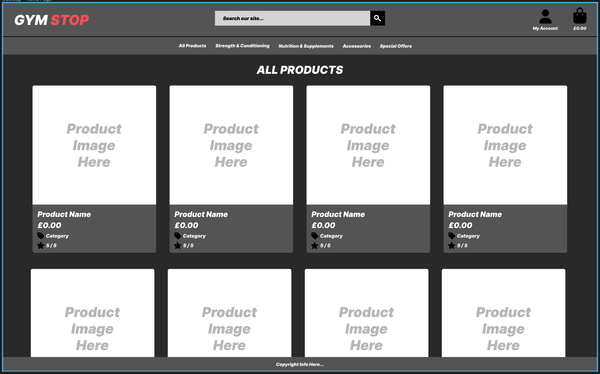

# Gym Stop


Gym Stop is an e-commerce website designed for users to search for and purchase a range products, leave reviews, create an account and subscribe to marketing emails.

The main goal for this application is to offer an easy-to-use and visually pleasing e-commerce website for the user.

Visit the deployed site [here](https://danh12-gym-stop-6494ee93884f.herokuapp.com/).

---

# User Experience (UX)

## Project Goals

- The application can be easily navigated and understood.
- Clearly explains the concept of the application.
- Clearly explains how to use the application.
- Contains clear imagery and content.
- Provides interactivity in the form of clickable elements.
- Provides feedback when the user performs a specific function.
- Provides users with the ability to create their own profile.
- Provides users with the ability to view and search for a variety of products.
- Provides users with the ability to search all products depending on keyword.
- Provides users with the ability to purchase products.
- Provides users with the ability to subscribe/unsubscribe to marketing emails.
- Provides users with the ability to leave a review of a product they have purchased.
- The game can be viewed on a variety of screen sizes.

## User Stories

### Viewing and Navigation

- **As a** Shopper, **I want** to view a list of products **so that** I can select some to purchase.
- **As a** Shopper, **I want** to view individual product details **so that** I can identify the price, description, product rating, product image, and available sizes.
- **As a** Shopper, **I want** to quickly identify deals, clearance items, and special offers **so that** I can take advantage of special savings on products I'd like to purchase.
- **As a** Shopper, **I want** to easily view the total of my purchases at any time **so that** I can avoid spending too much.

### Registration and User Accounts

- **As a** Site User, **I want** to easily register for an account **so that** I can have a personal account and be able to view my profile.
- **As a** Site User, **I want** to easily log in or log out **so that** I can access my personal account information.
- **As a** Site User, **I want** to easily recover my password in case I forget it **so that** I can recover access to my account.
- **As a** Site User, **I want** to receive an email confirmation after registering **so that** I can verify that my account registration was successful.
- **As a** Site User, **I want** to have a personalized user profile **so that** I can view my personal order history and order confirmations, and save my payment information.

### Sorting and Searching

- **As a** Shopper, **I want** to sort the list of available products **so that** I can easily identify the best rated, best priced, and categorically sorted products.
- **As a** Shopper, **I want** to sort a specific category of product **so that** I can find the best-priced or best-rated product in a specific category, or sort the products in that category by name.
- **As a** Shopper, **I want** to search for a product by name or description **so that** I can find a specific product I'd like to purchase.
- **As a** Shopper, **I want** to easily see what I've searched for and the number of results **so that** I can quickly decide whether the product I want is available.

### Purchasing and Checkout

- **As a** Shopper, **I want** to easily select the size and quantity of a product when purchasing it **so that** I ensure I don't accidentally select the wrong product, quantity, or size.
- **As a** Shopper, **I want** to view items in my bag to be purchased **so that** I can identify the total cost of my purchase and all items I will receive.
- **As a** Shopper, **I want** to adjust the quantity of individual items in my bag **so that** I can easily make changes to my purchase before checkout.
- **As a** Shopper, **I want** to easily enter my payment information **so that** I can check out quickly and with no hassles.
- **As a** Shopper, **I want** to view an order confirmation after checkout **so that** I can verify that I haven't made any mistakes.
- **As a** Shopper, **I want** to receive an email confirmation after checking out **so that** I can keep the confirmation of what I've purchased for my records.

### Reviews and Subscriptions

- **As a** Shopper, **I want** to receive marketing emails **so that** I can keep up to date with new deals and offers.
- **As a** Shopper, **I want** to ubsubscribe from marketing emails **so that** I can chose whether I want to see offers and deals.
- **As a** Shopper, **I want** to leave reviews on products I have purchased **so that** I can let other shoppers know what I think of the product.
- **As a** Shopper, **I want** to be able to edit reviews I have left **so that** I can update my rating, headline or description if I change my mind.
- **As a** Shopper, **I want** to be able to delete reviews I have left **so that** I can chose whether to leave my review for others to see.

### Admin and Store Management

- **As a** Store Owner, **I want** to add a product **so that** I can add new items to my store.
- **As a** Store Owner, **I want** to edit/update a product **so that** I can change product prices, descriptions, images, and other product criteria.
- **As a** Store Owner, **I want** to delete a product **so that** I can remove items that are no longer for sale.

## Colour Scheme


The primary colours used for this application are as follows:

- Jet (#383838) - for the main header/navbar and footer.
- Whitesmoke (#F5F5F5) - for the background to each page.
- Amber (#FFC107) - for the promotional banner, Shop Now button and most other major action buttons (Bootstrap's 'btn-warning' class colour).
- Black (#000000) - for the text, and some other major action buttons, such as account management and checkout buttons.

Other secondary colours are used for specific action buttons:

- Rusty Red (#DC3545) - for the 'Delete' buttons (Bootstrap's 'btn-danger' class).
- Brandeis Blue (#0D6EFD) - for the 'Edit' buttons (Bootstrap's 'btn-primary' class).

## Typography

The font-family used for this application is 'Lato' for the main body of text, with serif as a fallback.

## Wireframes

[Figma](https://www.figma.com/) was used to develop the initial concept of the main page of the application - the 'Products' page. The developer wanted to keep the main layout of this page a common theme across other pages of the application. However, the ideas for other pages were conceived as the project grew.

Page | Wireframe
--- | ---
Products | 

# Relational vs Non-Relational Database

Relational databases and non-relational databases are two of many databases which can be utilised in a web application. Each database differs in the way it uses data models and how data can be scaled with each model.

Relational
- Follow a structured, table-based model
- Data organised in rows and columns
- Good at managing structured data with complex relationships
- Suitable for applications requiring strong consistency, such as financial systems

Non-Relational
- Flexible data models like documents, key-value pairs, or graphs
- Prioritize scalability and accommodate dynamic, unstructured data
- Good at delivering horizontal scalability, such as web applications or real-time analytics

# Database Schemas

The database for this e-commerce application is hosted on ElephantSQL, a relational database service. The choice to use a relational database is crucial for this project because it allows for the structured linking of data models through foreign and primary keys, ensuring data integrity and efficient management of relationships between entities such as products, customers, and orders. This structure supports complex queries and transactions, which are essential for the robust functionality and scalability of an e-commerce site.

Please see database schemas below.

<details>
<summary>All Models</summary>


</details>

<details open>
<summary>Custom Models</summary>


</details>

# Features

- The application was designed from a mobile-first perspective.
- The application is responsive on all screen sizes:
  - This allows the user to [view the website on a variety of screen sizes](#user-stories).

## Navbar

## Home

## Footer

## Footer (Extended)

## Products

## Account Management

## Profile

## Reviews

## Subscribe

## Bag

## Checkout

## Flashed Messages

When a user performs a major action in the application, such as signing in, registering or ordering a product, subscribing, etc, a message is shown in the top right corner of the screen to let the user know the status of that action. This provides the user with [feedback based on their interaction with the web application](#user-stories).

Click below to see all the flashed messages shown depending on action and outcome.

Type | Use-Case | Message
--- | --- | ---
Success | Used to display confirmation of a successful action to the user, e.g. a successful purchase. | 
Error | Shown when an action fails, such as when form validation errors occur or a payment process fails. | 
Info | Used to provide general information to the user, such as indicating they are viewing an old order. | 
Warning | Issued to alert the user about potential issues, such as when the superuser is editing a product. | 

# Technologies Used

## Languages

- [HTML](https://en.wikipedia.org/wiki/HTML)
- [CSS](https://en.wikipedia.org/wiki/CSS)
- [JavaScript](https://en.wikipedia.org/wiki/JavaScript)
- [Python](https://en.wikipedia.org/wiki/Python_(programming_language))

## Frameworks, Libraries & Programs

- [GitPod](https://codeinstitute-ide.net/workspaces)
  - CI's GitPod was used for writing, committing and pushing the code to GitHub.

- [Bootstrap5](https://getbootstrap.com/docs/5.3)
  - Bootstrap5 was used to develop a responsive mobile-first design using an assortment of templates.

- [Font Awesome](https://fontawesome.com/)
  - Font Awesome was used to add icons/images to the computer and player tiles.

- [Django](https://www.djangoproject.com/)
  - Django was used as the web application framework for use with Python and the templating engine for this application.

- [ElephantSQL](https://www.elephantsql.com/)
  - ElephantSQL was used as the data platform for this application to perform CRUD functionality.

- [jQuery](https://jquery.com/)
  - jQuery was used as the preferred JavaScript library for HTML document traversal and manipulation, event handling and animation.

- [Chrome DevTools](https://developer.chrome.com/docs/devtools/)
  - Chrome DevTools was used throughout the development of the website to test ideas and responsiveness, as well as test functionality of the application and debug issues that arose.

- [W3C Markup Validator](https://validator.w3.org/)
  - W3C Markup Validator was used to validate the HTML code.

- [W3C CSS Validator](https://jigsaw.w3.org/css-validator/)
  - W3C CSS Validator was used to validate the CSS code.

- [JSHint](https://jshint.com/)
  - JSHint was used to validate the JavaScript.

- [Flake8](https://flake8.pycqa.org/en/latest/)
  - Flake8 was used to validate the Python.

# Testing

A large amount of testing was undertaken throughout the project in order to assess if the application was working as expected.

Friends and family also participated in testing the application's functionality and expressed any concerns or ideas they had with function, layout and user experience.

Please see a detailed breakdown of the testing carried out for this application in [TESTING.md](TESTING.md).

# Finished Product

<details>
<summary></summary>

</details>

# Deployment

This website was developed using [CI's GitPod](https://codeinstitute-ide.net/workspaces), then committed and pushed to GitHub using the GitPod terminal.

## Heroku Deployment

The project was deployed to Heroku using the following steps:

1. Create a `requirements.txt` file using the terminal command:

   ```bash
   pip freeze > requirements.txt
   ```

2. Create a `Procfile` with the terminal command:

   ```bash
   echo web: python app.py > Procfile
   ```

3. `git add` and `git commit` the new requirements and Procfile and then `git push` the project to GitHub.
4. Create a new app on the [Herkou website](https://dashboard.heroku.com/apps) by clicking the "New" button in your dashboard. Give it a name and assign the region to Europe.
5. From the Heroku dashboard of your newly created application, click on "Deploy" > "Deployment Method" and select GitHub.
6. Confirm the linking of the Heroku app to the correct GitHub repository.
7. In the Heroku dashboard, click "Deploy".
8. In the "Manual Deployment" section of this page, make sure the "Master Branch" is selected and then click "Deploy Branch".

## Local Development

### How to Fork

To fork the repository:

1. Log in (or sign up) to Github.
2. Go to the repository for this project, [My CookBook](https://github.com/DanHodgson12/my-cook-book).
3. Click the Fork button in the top right corner.

### Making a Local Clone

To clone the repository:

1. Log in (or sign up) to GitHub.

2. Go to the repository for this project, [My CookBook](https://github.com/DanHodgson12/my-cook-book).

3. In the "Clone with HTTPs" section, copy the clone URL for the repository.

4. Open the terminal in your code editor and change the current working directory to the location you want to use for the cloned directory.

5. Type `git clone`, then paste the URL you copied in Step 3, the press Enter:

    ```bash
    git clone https://github.com/DanHodgson12/my-cook-book.git
    ```

6. Install the packages from the requirements.txt file by running the following command in the Terminal:

    ```bash
    pip3 install -r requirements.txt
    ```

7. Your local clone will now be created.

# Credits

## Content

- All content was written by the developer.
- Example products were generated by [ChatGPT](https://chatgpt.com/) and loaded in as fixtures.
- Example reviews were manually added by the developer.

## Media

- [Font Awesome](https://fontawesome.com/icons) was used for providing the icons used in the application.
- The product images were copied from existing products on [Amazon](https://www.amazon.co.uk/ref=nav_logo).
- The favicon is a flexed biceps emoji taken from [emojipedia.org](https://emojipedia.org/facebook/15.0/flexed-biceps).
- All other styling and media was created by the developer.

## Code

- [Materialize](https://materializecss.com/getting-started.html) was used throughout to help with responsiveness and styling purposes.
- [W3Schools](https://www.w3schools.com/) & [Stack Overflow](https://stackoverflow.co/teams/) were consulted on a regular basis to help overcome roadblocks in the developer's coding knowledge.
- [Bulma](https://bulma.io/documentation/elements/icon/) was used for an icon class.
- [CSS-tricks.com](https://css-tricks.com/snippets/css/css-triangle/) was used for the 'arrow-up' class for the toasts.
- [Favicon.io](https://favicon.io/favicon-converter/) was used to generate the favicon for the application.

# Acknowledgements

- My family, for their valuable opinions and unconditional support.
- My mentor, Marcel, for his encouraging feedback and patience during my learning journey.
- Code Institute, for its wonderful learning platform and supportive community.