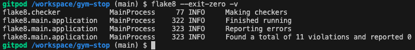

# Testing

## Testing Paradigms

There are two types of testing a developer can carry out before, during and after writing a web application - Automated and Manual.

### Automated Testing

1. __Quicker__: Automated testing allows for hundreds of tests to be run in a short space of time, making it more resourceful than Manual testing.
2. __Efficient__: Tests written by developers help to detect errors earlier on, and help avoid writing code that likely won't perform as expected.
3. __Specific__: Tests can be written for specific edge cases in which manual testing may not be able to pick up.
4. __Resourceful__: Automated tests can be used for continuous testing of an application, making it easier to find an error if a new piece of content is added to a page, for example.
5. __Data-driven__: Automated testing can be used to check if a piece of code provides the same outcome when using different sources of data.

### Manual Testing

1. __UX(User Experience)__: Manual testing allows for the developer to check if the user experience of the application is as intended.
2. __Layout/Responsiveness__: Manual testing allows for the developer to inspect the application on different browsers and devices, which is something automated testing would not pick up on.
3. __Animation & Interactivity__: Manual testing allows for the developer to check if animations and interactions between elements are performing as expected.
4. __Accessibility__: Manual testing allows the developer to test the application with screen readers and make sure it is accessible.

Although one form of testing may be more appropriate than the other for a specific application, they do both have downsides. The disadvantage of one form of testing is usually something the other form of testing can provide.

Due to this, it is best practice to utilise both forms of testing during the building of an application. However, the choice for which form of testing to use depends on resources available, budget and whether or not you have a team large enough to carry out the tests.

The developer chose to use automated testing as the main form of testing throughout this project. They felt it was an efficient method for this type of application due to its size and the fact that a lot of aspects of the application relied on functions rendering and manipulating data.

## Code Testing

Automated code testing was carried out within the development environment. Each Python file was tested inside its own test file - each test file was name after the file being tested, prepended with 'test_' (for example, views.py's test file is named test_views.py). If you navigate to the test files for each app in the GitHub repository, you will see a detailed view of all tests carried out.

[Coverage](https://coverage.readthedocs.io/en/7.5.3/) was used to check how much of the Python code had been tested. You can see in the image below that 98% of the code has been covered with testing.

The 'settings.py' and 'manage.py' files were ignored, as they had been set up automatically as part of the project creation aspect of Django, with minor adjustments made to variables within.

Due to time constraints, a high amount of manual testing being carried out on the subscribe, checkout and profiles app, and no functionality issues noticed in the manual testing of the website in general, the developer chose to ignore the lines not being tested in these files.

## Testing User Stories

### Viewing and Navigation

- **As a** Shopper, **I want** to view a list of products **so that** I can select some to purchase.
  - **Given** I click the "Shop Now" button on the home page, or click the "All Products" link in the navigation menu, **then** I will see a list of products to view.
- **As a** Shopper, **I want** to view individual product details **so that** I can identify the price, description, product rating, product image, and available sizes.
  - **Given** I click on the individual product card, **then** I will see the full product detail page, showing the price, description, product rating, product image, and available sizes.
- **As a** Shopper, **I want** to quickly identify deals, clearance items, and special offers **so that** I can take advantage of special savings on products I'd like to purchase.
  - **Given** I look beneath the main navigation menu, **then** I will see that there is an offer for free delivery on orders over £50.
- **As a** Shopper, **I want** to easily view the total of my purchases at any time **so that** I can avoid spending too much.
  - **Given** I look in the top right corner of the navigation menu, **then** I will see the bag icon showing the total cost of items in my bag.

### Registration and User Accounts

- **As a** Site User, **I want** to easily register for an account **so that** I can have a personal account and be able to view my profile.
  - **Given** I click the 'My Account' icon in the navigation menu, then click the 'Register' link, **then** I will be able to register with an account.
- **As a** Site User, **I want** to easily log in or log out **so that** I can access my personal account information.
  - **Given** I click the 'My Account' icon in the navigation menu, then click the 'Login' or 'Logout' link, **then** I will be able to log in or out of my account.
- **As a** Site User, **I want** to easily recover my password in case I forget it **so that** I can recover access to my account.
  - **Given** I am on the login page and I click the 'Forgot Password?' link, **then** I will be able to reset my password.
- **As a** Site User, **I want** to receive an email confirmation after registering **so that** I can verify that my account registration was successful.
  - **Given** I register with an account with a valid email address, **then** I will receive an email asking me to click a link to verify my account.
- **As a** Site User, **I want** to have a personalized user profile **so that** I can view my personal order history and order confirmations, and save my payment information.
  - **Given** I click the 'My Account' icon in the navigation menu, then click the 'My Profile' link, **then** I will be able to see my saved payment and delivery information and order history.

### Sorting and Searching

- **As a** Shopper, **I want** to sort the list of available products **so that** I can easily identify the best rated, best priced, and categorically sorted products.
  - **Given** I click the 'All Products' dropdown link in the navigation menu and select from one of the dropdown options, **then** I will be able to sort by price, rating or category.
- **As a** Shopper, **I want** to sort a specific category of product **so that** I can find the best-priced or best-rated product in a specific category, or sort the products in that category by name.
  - **Given** I click the 'Sort by...' dropdown in the top right corner of the products page, **then** I will be able to sort by price, rating, name and category of product in ascending or descending order.
- **As a** Shopper, **I want** to search for a product by name or description **so that** I can find a specific product I'd like to purchase.
  - **Given** I type keywords into the search bar in the middle of the navigation menu, **then** I will be able to search for an item containing that keyword in the product name, category or description.
- **As a** Shopper, **I want** to easily see what I've searched for and the number of results **so that** I can quickly decide whether the product I want is available.
  - **Given** I look at the top left of the product page, **then** I will see the number of results returned for the search criteria I have entered.

### Purchasing and Checkout

- **As a** Shopper, **I want** to easily select the size and quantity of a product when purchasing it **so that** I ensure I don't accidentally select the wrong product, quantity, or size.
  - **Given** I navigate to a product detail page and select the size and quantity with the appropriate buttons, **then** I will be able to add the correct size and quantity of product to my bag.
- **As a** Shopper, **I want** to view items in my bag to be purchased **so that** I can identify the total cost of my purchase and all items I will receive.
  - **Given** I look at the success message shortly after adding a product to my bag, or I click on the shopping bag link in the navigation menu, **then** I will be able to see the cost of individual items as well as a subtotal and total of all items.
- **As a** Shopper, **I want** to adjust the quantity of individual items in my bag **so that** I can easily make changes to my purchase before checkout.
  - **Given** I navigate to the shopping bag, **then** I will be able to see different sizes of the same product individually, so I can easily make changes to my order.
- **As a** Shopper, **I want** to easily enter my payment information **so that** I can check out quickly and with no hassles.
  - **Given** I click the 'Secure Checkout' button in my shopping bag, **then** I will be prompted to enter delivery and billing information to finalise my purchase.
- **As a** Shopper, **I want** to view an order confirmation after checkout **so that** I can verify that I haven't made any mistakes.
  - **Given** I finalise my purchase, or I click the link for the order number in my profile's Order History section, **then** I will see an order confirmation page showing the specific details of my order.
- **As a** Shopper, **I want** to receive an email confirmation after checking out **so that** I can keep the confirmation of what I've purchased for my records.
  - **Given** I finalise my purchase, **then** I will be sent a confirmation email showing the details of my order.

### Reviews and Subscriptions

- **As a** Shopper, **I want** to receive marketing emails **so that** I can keep up to date with new deals and offers.
  - **Given** I click the 'Subscribe' button in the page footer, or click the 'Subscribe to marketing emails?' option in my profile's saved information, **then** I will receive marketing emails.
- **As a** Shopper, **I want** to ubsubscribe from marketing emails **so that** I can chose whether I want to see offers and deals.
  - **Given** I click the 'Unsubscribe' link in a marketing email, or uncheck the 'Subscribe to marketing emails?' option in my profile's saved information, **then** I will be unsubscribed from marketing emails.
- **As a** Shopper, **I want** to leave reviews on products I have purchased **so that** I can let other shoppers know what I think of the product.
  - **Given** I am logged in, navigate to the specific product page of a product I have purchased, **then** I can click the 'Add Review' button to leave a review.
- **As a** Shopper, **I want** to be able to edit reviews I have left **so that** I can update my rating, headline or description if I change my mind.
  - **Given** I am logged in, navigate to the specific product page of a product I have purchased, find the review and click the 'Edit' button, **then** I will be able to delete the review.
- **As a** Shopper, **I want** to be able to delete reviews I have left **so that** I can chose whether to leave my review for others to see.
  - **Given** I am logged in, navigate to the specific product page of a product I have purchased, find the review and click the 'Delete' button, **then** I will be able to delete the review.

### Admin and Store Management

- **As a** Store Owner, **I want** to add a product **so that** I can add new items to my store.
  - **Given** I am a superuser and am logged in, **then** I can navigate to the 'Product Management' page via the 'My Account' link in the navigation menu, and add a product.
  - **Given** I am a superuser and am logged in to the admin panel, **then** I can navigate to the 'Products' section and manually add a product
- **As a** Store Owner, **I want** to edit/update a product **so that** I can change product prices, descriptions, images, and other product criteria.
  - **Given** I am a superuser and am logged in, **then** I can navigate to the specific product detail page, click the 'Edit' button and edit a product.
  - **Given** I am a superuser and am logged in to the admin panel, **then** I can navigate to the 'Products' section and manually edit a product
- **As a** Store Owner, **I want** to delete a product **so that** I can remove items that are no longer for sale.
  - **Given** I am a superuser and am logged in, **then** I can navigate to the specific product detail page, click the 'Delete' button and delete a product.
  - **Given** I am a superuser and am logged in to the admin panel, **then** I can navigate to the 'Products' section and manually delete a product

## Tools Testing

- [Google Chrome DevTools](https://developer.chrome.com/docs/devtools/)
  - Google Chrome DevTools was used throughout the development process to test, explore and make changes to the HTML and CSS of the webpage.
  - Google Chrome DevTools was used throughout the development process to test, explore and debug any issues with the Javascript or Python affecting the functionality of the application.

- Responsiveness
  - [Responsive Design Checker](https://www.responsivedesignchecker.com/) was used to check responsiveness across a variety of devices and screen sizes.
  - [Am I Responsive?](https://ui.dev/amiresponsive) was used to check responsiveness across different screen sizes and generate the mockup final image.
  - [Google Chrome DevTools](https://developer.chrome.com/docs/devtools/) was used to check responsiveness across different screen sizes during the development and testing phases.

## Compatibility Testing

### Browser Compatibility

Browser | Outcome | Pass/Fail
--- | --- | ---
Google Chrome | No appearance, responsiveness or functionality issues | Pass
Safari | No appearance, responsiveness or functionality issues | Pass
Mozilla Firefox | No appearance, responsiveness or functionality issues | Pass
Microsoft Edge | No appearance, responsiveness or functionality issues | Pass
  
### Device Compatibility

The web application was tested across a wide variety of devices using [Google Chrome DevTools](https://developer.chrome.com/docs/devtools/) & [Responsive Design Checker](https://www.responsivedesignchecker.com/).

- No appearance, responsiveness or functionality issues were found.

## Common Elements Testing

### Navbar

#### Main Header Functionality

Outcome | Pass/Fail
--- | ---
Logo reloads the home page when clicked, as expected | Pass
Can enter text in search bar | Pass
Search bar returns products with search criteria | Pass
My Account button highlighted when hovered over | Pass
My Account button displays dropdown | Pass
My Account dropdown links take user to appropriate page when clicked | Pass
Bag icon button highlighted when hovered over | Pass
Bag icon changes colour when items in bag | Pass

#### Nav Links Functionality

Outcome | Pass/Fail
--- | ---
Nav links highlighted when hovered over | Pass
Nav links display relevant dropdown when clicked | Pass
Nav link dropdown links take user to appropriate page when clicked | Pass

### Home

Outcome | Pass/Fail
--- | ---
Text displayed clearly with no formatting issues | Pass
Background image displayed clearly with no pixelation or stretching | Pass
Shop Now button takes user to 'All Products' page as expected | Pass

### Footer

Outcome | Pass/Fail
--- | ---
Shows on all pages | Pass
Stays at bottom of screen (unless when looking at extended footer) as expected | Pass
Social links navigate to respective website in a new tab | Pass
Subscribe button shows the subscribe modal | Pass

### Footer (extended)

Outcome | Pass/Fail
--- | ---
Shows on only the Home page and legal information pages | Pass
Displays About and Contact information clearly | Pass
Displays Ts&Cs, Privacy Policy and Returns Policy links | Pass
Ts&Cs, Privacy Policy and Returns Policy links take user to respective page | Pass

### Products

Outcome | Pass/Fail
--- | ---
All available products rendered appropriately in different column count depending on screen width | Pass
Each product displays relevant product info | Pass
Each product can be clicked which takes user to product detail page for specific product | Pass
Product card's category tag renders products in specific category when clicked | Pass
Selecting option in the 'Sort by...' dropdown reloads the page and renders products accordingly | Pass
'Products Home' link takes user back to 'All Products' page | Pass
Product's rating displayed correctly depending on average rating of reviews left on product | Pass
Product 'Edit' and 'Delete' buttons show ONLY when a superuser is logged into the site | Pass
Product 'Edit' button takes user to respective 'Edit Product' page | Pass
Product 'Delete' button opens modal asking user if they want to proceed | Pass
After clicking delete button on Delete modal, product is successfully deleted | Pass

### Product Detail

Outcome | Pass/Fail
--- | ---
All relevant product information is displayed: image, price, category, rating, description | Pass
Size selection dropdown is shown ONLY when the product has different sizes | Pass
Quantity selector is shown correctly, with min and max value validation working as expected | Pass
'Add To Bag' button successfully adds product to bag and shows success message with bag preview | Pass
'Keep Shopping' button takes user back to the same page in which they navigated to the product detail page from | Pass
Product card's category tag renders products in specific category when clicked | Pass
Product's rating displayed correctly depending on average rating of reviews left on product | Pass
Reviews section shows the product's reviews if any, and placeholder text if none | Pass
'Add Review' button shows ONLY when user is logged in and has purchased product before | Pass
'Add Review' button takes user to 'add_review' page where they can leave a review | Pass
Review 'Edit' and 'Delete' buttons show ONLY when a user has left that review | Pass
Review 'Edit' button takes user to respective 'Edit Review' page | Pass
Review 'Delete' button opens modal asking user if they want to proceed | Pass
After clicking delete button on Delete modal, review is successfully deleted | Pass
Product 'Edit' and 'Delete' buttons show ONLY when a superuser is logged into the site | Pass
Product 'Edit' button takes user to respective 'Edit Product' page | Pass
Product 'Delete' button opens modal asking user if they want to proceed | Pass
After clicking delete button on Delete modal, product is successfully deleted | Pass

### Add Product

Outcome | Pass/Fail
--- | ---
All form fields are rendered correctly | Pass
All fields show relevant placeholders | Pass
All fields have relevant field validation | Pass
'Select Image' button allows user to upload image file | Pass
'Cancel' button takes user back to original page they navigated from | Pass
'Add Product' button successfully adds product which then renders on products page | Pass

### Edit Product

Outcome | Pass/Fail
--- | ---
All form fields are rendered with the product's current information | Pass
All fields show relevant placeholders | Pass
All fields have relevant field validation | Pass
'Select Image' button allows user to change image file | Pass
'Cancel' button takes user back to original page they navigated from | Pass
'Update Product' button successfully updates product's information | Pass

### Account Management

Outcome | Pass/Fail
--- | ---
Login form renders correctly | Pass
Only users with an active account can log in | Pass
Login form fields have relevant validation | Pass
Login page shows reminder for user to 'Register' if they don't have an account | Pass
Login page shows 'Forgot Password' link which allows user to reset password | Pass
Logout page shows 'are you sure' message with link to sign out | Pass
Clicking 'Sign Out' button successfully signs user out | Pass
Register form renders correctly | Pass
Register form fields have relevant validation | Pass
User can only register account with an email address that isn't already link to an account | Pass
User is required to verify email address before proceeding | Pass

### Profile

Outcome | Pass/Fail
--- | ---
User's profile renders form for saved info correctly | Pass
Changing info in form and clicking 'Update Information' button updates the saved info | Pass
Order History is rendered correctly | Pass
Clicking on an order number link takes user to order detail page for that order | Pass
User can subscribe or unsubscribe to marketing emails in saved info form | Pass

### Reviews

Outcome | Pass/Fail
--- | ---
All products reviews are rendered on Product Detail page | Pass
Only users who have purchased a product can see the 'Add Review' button on Product Detail page | Pass
Only users who have left a specific review can see it's 'Edit' and 'Delete' buttons | Pass
Indiviual rating of each review of a product updates the products average rating correctly | Pass
Editing or Deleting a review updates the product's average rating accordingly | Pass

### Subscribe

Outcome | Pass/Fail
--- | ---
Subscribe button shown correctly in footer | Pass
Subscribe button opens subscribe modal when clicked | Pass
Subscribe modal renders subscribe form correctly with relevant validation | Pass
Error message displayed when an email address is already subscribed, and whether it's linked to an existing account | Pass
Clicking 'Subscribe to marketing emails?' box on user's Profile page successfully subscribes user | Pass
Success message displayed when email address successfully subscribed | Pass
Email sent to email address after being successfully subscribed | Pass
Unsubscribe link in marketing emails takes user to Unsubscribe page | Pass
Entering subscribed email address in unsubscription form and clicking 'Unsubscribe' button successfully unsubscribes email address | Pass
Unchecking 'Subscribe to marketing emails?' box on user's Profile page successfully unsubscribes user | Pass
Success message displayed when email address is successfully unsubscribed | Pass

### Bag

### Checkout

## Known Bugs

There are no known bugs with the web application.

## Code Validation

The [W3C Markup Validator](https://validator.w3.org/) and [W3C CSS Validator](https://jigsaw.w3.org/css-validator/) services were used to check for any code errors or misuse of syntax/elements in the HTML & CSS.

The [JSHint](https://jshint.com/) service was used to check for any code errors or misuse of syntax in the JavaScript.

The [CI Python Linter](https://pep8ci.herokuapp.com/) and [Flake8](https://flake8.pycqa.org/en/latest/) services were used to check for any linting errors in the Python code.

### HTML

The W3C Markup Validator returned multiple errors and warnings with a lot of the Django templating language used. The developer chose to ignore these specific warnings, as this tool is primarily designed to validate static HTML and doesn't recognize server-side templating languages, including Django.

Other than the above, there were no legitimate errors in the HTML code.

### CSS

The W3C CSS Validator returned no errors in the code.

### JavaScript

The JSHint Validation returned a one error in the JS files for undefined variables:

- `$` - This was ignored as it is required for functions using jQuery.

### Python

Flake8 returned 11 errors in the code. However, these errors were mainly for "line too long" in the 'migrations' files. These were left untouched as they were autmoatically generated files.

There were also other files such as env.py, settings.py and apps.py (for each project) that teh developer chose to ignore.

There was also one error type that was chosen to be ignored - *W503 line break before binary operator*. Upon fixing this error, another error occurs - *W504 line break after binary operator*. As these errors conflict with one another, the decision was made to chose to ignore one of the errors - W503.

## Lighthouse Report

Lighthouse in Google Chrome Dev Tools was used to test performance, accessibility, best practices and search engine optimisation of the webpage.